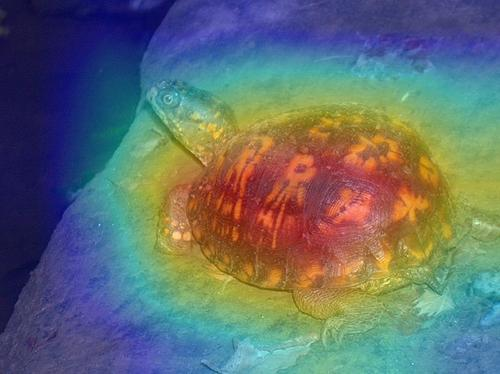

# Overview
The implementation of [Grad-CAM](https://arxiv.org/abs/1610.02391) for getting the attention map of CNN

# Update
> **[2021/12/03]**  
> optimize the speed of generating the heatmap

# Example



# Usage
- The example image is generate from mobilenetv2:  
```
python show.py -d cpu -img assets/n01669191_46.JPEG -layer features.18.0
```

- for custom model  
model path is a file including weight and architecture. 
```
python show.py -d cpu -img assets/n01669191_46.JPEG -layer {layer name} -m {your model path}
```
- Get predict label  
  My program will print the predict label, you can refer to `show.py`.  
  For imagenet label to class name, you can refer to [class id to name](https://gist.github.com/yrevar/942d3a0ac09ec9e5eb3a).
  
# Note
- Remenber to check whether the image preprocess is the same as yours, if not, you should alert the preprocess in the `show.py` or the result will be wrong.
- If you have cuda, you can just replace the "cpu" to "cuda".
- If you don't specify any layer, my code will use the last layer before global average pooling  to plot heatmap.
- Generally, the layer is deeper, the interpretaton is better. Accordingly, using the last layer before last global average layer to plot heatmap would be a nice choice.

